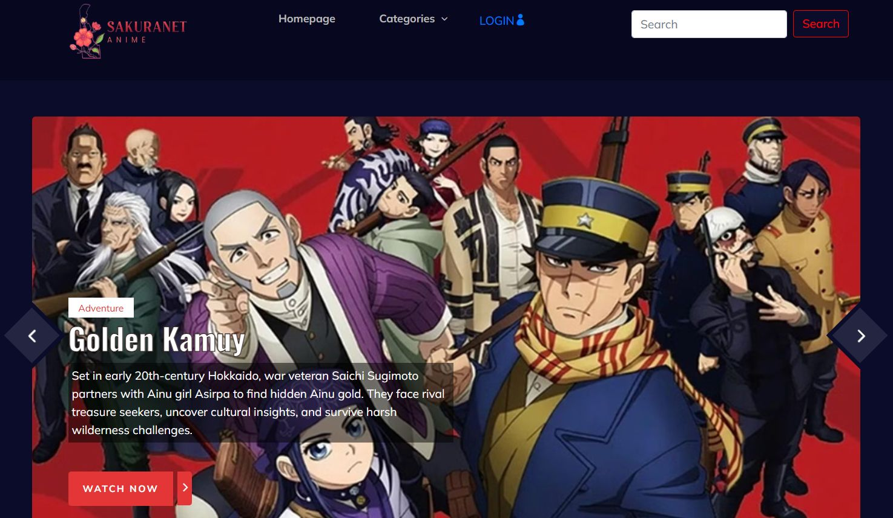

# 🍥 SakuraNet – Anime Streaming Website

**SakuraNet** is a PHP + MySQL-based online streaming platform built to showcase anime content in a structured, semi-dynamic way. Developed as part of a guided Udemy project titled _"PHP with MySQL - Build an Amazing Streaming Service"_ under the mentorship of Mohamed Hassan.



---

## 🌸 Key Features

- ✅ **User Authentication**  
  Users can **sign up** and **log in** to personalize their anime journey.

- ✅ **Anime Library with Categories**  
  Browse anime by **genre**, **popularity**, or search by name.

- ✅ **User Engagement**  
  Comment on your favorite anime titles and interact with the community.

- ✅ **Follow System**  
  Logged-in users can **follow/unfollow anime**, receive updates and recommendations.

- ✅ **Dynamic View Count**  
  Views are updated in real-time as users explore different anime.

---

## 💻 Tech Stack

| Component      | Description                                   |
|----------------|-----------------------------------------------|
| **Frontend**   | HTML, CSS, JavaScript                         |
| **Backend**    | PHP                                           |
| **Database**   | MySQL (via phpMyAdmin)                        |
| **Server**     | Apache (XAMPP recommended for local hosting)  |

---

## 🛠 How to Set It Up

### 1. Clone the Repository
```
git clone https://github.com/your-username/sakuranet-anime.git
cd sakuranet-anime
````

### 2. Start Apache and MySQL (XAMPP)

* Open **XAMPP Control Panel**
* Start both **Apache** and **MySQL**
* Go to `http://localhost/phpmyadmin`

### 3. Import the SQL Database

* Create a new database (e.g., `sakuranet`)
* Import the provided `.sql` file into phpMyAdmin

### 4. Run the Website Locally

Place the project folder inside:

```
C:\xampp\htdocs\sakuranet
```

Then visit:

```
http://localhost/sakuranet
```

---

## 🧩 Folder Structure

```
/sakuranet
├── /admin-panels      # Includes the resources for admin portal
├── /includes          # Reusable PHP files (navbar, footer)
├── /config            # DB Connection
├── /css               # All the styles used in the project
├── /js                # Includes all the javascript of the project
├── /users             # Personalized user side following page
├── /anime             # Anime detail pages
├── /auth              # Login, register, logout
├── index.php          # Homepage
├──anime-details.php
├──anime-watching.php
├──404.php
├── categories.php     # Genre-wise browsing
└── database.sql       # SQL file to import
```

---

## 🔒 Security Notes

* Passwords are hashed using `password_hash()`
* Uses `mysqli_real_escape_string` to prevent SQL injection
* Session-based login system

---

## 📈 Skills Demonstrated

* PHP backend development
* SQL database design and management
* Dynamic web page rendering
* User session management
* Frontend + Backend integration
* Hosting via Apache using XAMPP

---

## 🧠 Learning Outcome

Through this project, I have:

* Strengthened my PHP & MySQL skills
* Learned to build semi-dynamic content pages
* Integrated user-based personalization features
* Explored database-driven content delivery
* Understood basic session & cookie management in PHP

---

## 📄 License

This project is open-source under the MIT License.

---

## 👤 Author

Built by **Swarupa Balaji**
